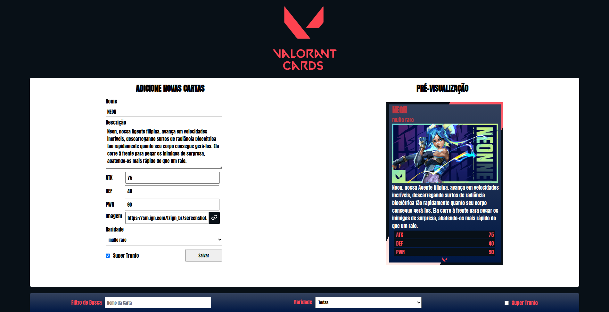

# Seja bem-vindo ao projeto Tryunfo!!🃏🎴

#### Esse projeto propõe um site onde o usuário pode montar uma carta com os atributos desejados. Montei esse projeto no tema do jogo Valorant mas o usuário pode montar a carta do tema que desejar, assim como pode visualizar suas cartas depois de montadas. Com certeza e um dos projetos que eu mais me orgulho. 😁

  

## Tecnologias :

<ul>
  <li>HTML</li>
  <li>CSS</li>
  <li>Java Script</li>
  <li>React</li>
</ul>

## Funcionalidades:

- Possível escolher nome, descrição, imagem e raridade para sua carta.
- Possível escolher atributos para sua carta (com limite de 210 pontos no total e 90 para cada).
- Possível marcar uma carta como 'Super Trunfo' (simulando um coringa).
- Possível visualizar lista de cartas salvas.
- Possível filtrar cartas salvas por nome, raridade e Super Trunfo.

## Como executar:

- Clone em seu computador (via SHH).
- Abra um novo terminal em seu VSCode.   
- Execute o comando para instalar dependências: `npm install`.
- Para incializar execute o comando: `npm start`.

## Também disponível em:

### <a href="https://tryunfo-kappa.vercel.app/" ><b>Tryunfo</b></a>

## Como contribuir no projeto:
  1. Faça um **fork** do projeto;
  2. Crie uma nova branch com as suas alterações: `git checkout -b my-feature`;
  3. Salve as alterações e crie uma mensagem de commit contando o que você fez: `git commit -m "feature: My new feature"`;
  4. Envie as suas alterações: `git push origin my-feature`;
  5. Abra o seu pull-request na página do GitHub.  

## Licença:

 Esse projeto está sob a licença: 

 

 ##  Autor:

### <a href="https://www.linkedin.com/in/jorge-reis-dev/" ><b>Jorge Wellington.</b></a>
